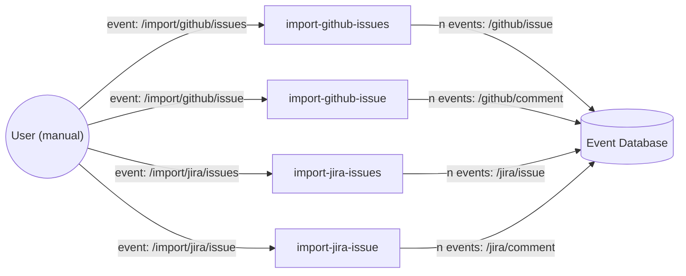

# ✨ a new dashboard approach ✨

This repository contains Knative functions to import and watch Jira and GitHub.

## Import and monitor data with Knative functions and cloudevents

<!-- see https://mermaid.js.org/syntax/flowchart.html -->



To trigger the imports:

* `/import/github/issues` with parameters for org, repo and authToken
* `/import/github/issue` with parameters for org, repo and authToken
* `/import/jira/project` with parameters for project, jql (?) and authToken
* `/import/jira/issue` with parameters for key

Cloudevents with data we want to persist:

* `/github/issue` for each issue (metadata)
* `/github/comment` for each comment (how to handle reviews and status updates?)
* `/jira/issue` for each issue (metadata)
* `/jira/comment` for each comment (how to handle status updates?)

* `/enh/github/openedby` for each PR, resolves the origin author when the PR was opened by a bot
* `/enh/github/retest` for each triggered /retest

Some links:

* https://knative.dev/docs/samples/serving/
* https://knative.dev/docs/samples/eventing/
* https://github.com/knative/func/blob/main/docs/function-templates/typescript.md
* https://docs.openshift.com/serverless/1.29/functions/serverless-developing-typescript-functions.html

Issues with `func create` TypeScript template:

* Doesn't work with node 14? Switched to node 18
* TypeScript compiler issues. Updated typescript and @types/node:
```
npm add -D typescript@latest
npm add -D @types/node
```

## Persist data

TODO

## Query data

TODO

## Backstage plugin

TODO


